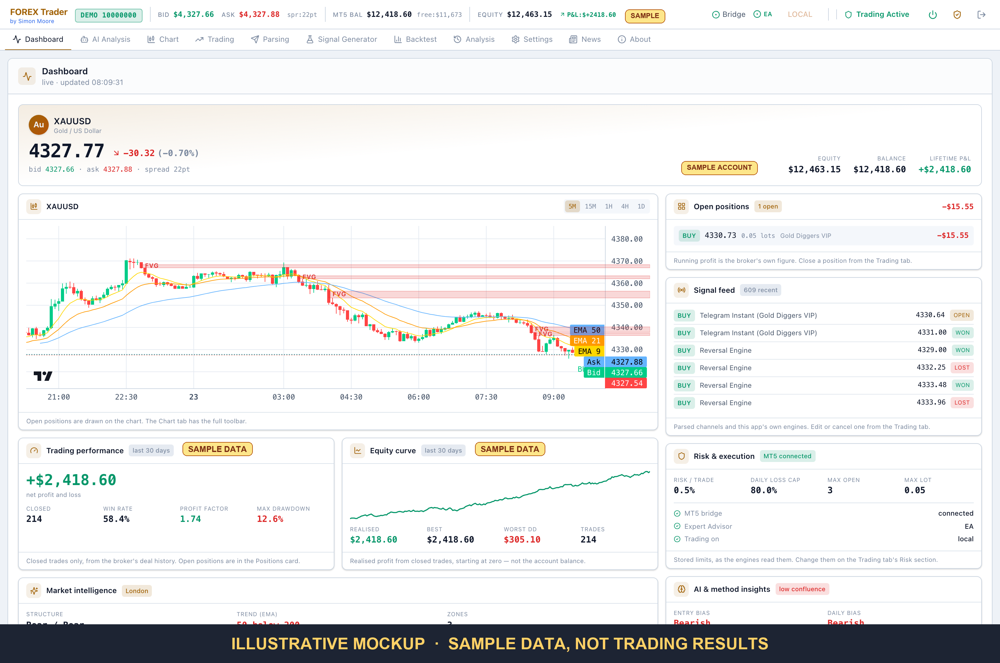
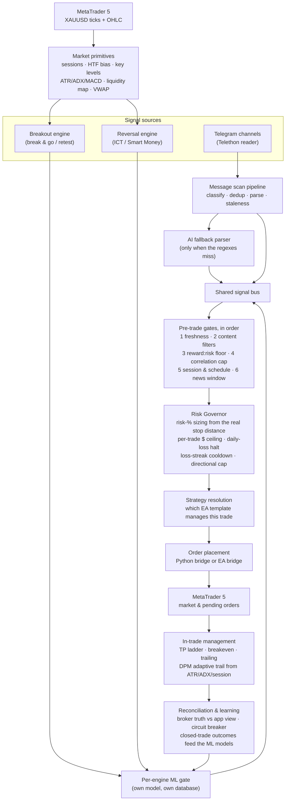
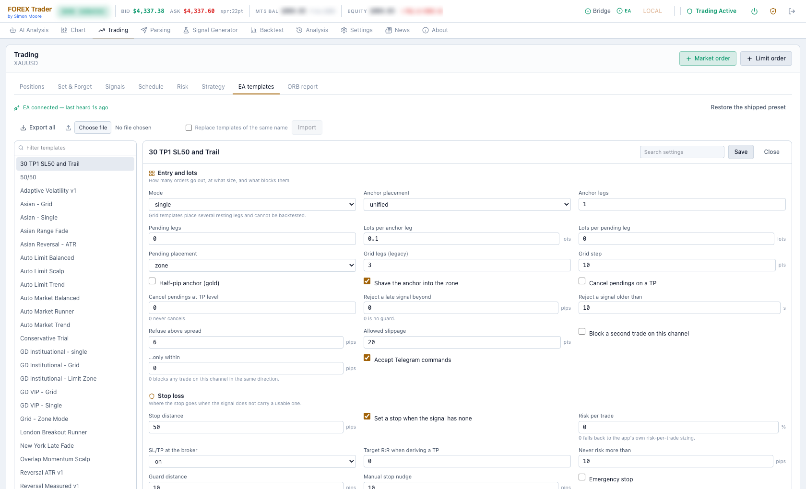

# FOREX Trader

An automated XAUUSD (gold) trading application. It runs its own signal engines,
reads trade calls from Telegram channels, applies deterministic risk rules,
places and manages real orders through MetaTrader 5, and shows every decision
it made in a local web dashboard.

> **This trades real money on a live broker account.**
> Connecting the MT5 bridge and enabling auto-execution places real orders
> against a real account. Nothing here is financial advice. Run it on a demo
> account until you understand what every switch does, and confirm your risk
> settings before you ever point it at live funds.



> **Illustrative mockup.** The account, the performance card and the equity
> curve above hold **sample data** — invented figures, rendered through the
> real interface to show what the screen looks like in use. They are not
> trading results, not a backtest, and not a claim about what this software
> earns. Everything else is live: the gold price, the chart and its structure,
> the signal feed. **No performance claim is made anywhere in this README.**

*The Dashboard — one screen for "what is happening right now". The live gold
price and the account above; XAUUSD with the structure the engines actually
trade drawn on it — fair value gaps as shaded zones, the EMA 9/21/50 stack,
live bid/ask rails, and every open position marked at its entry, stop and
targets. Down the right: what is open, the signals that arrived, and the risk
limits the engines are actually reading. Below, the realised record over the
window, whichever way it points.*

---

## Running it

```bash
git clone https://github.com/MooreSi/forex-gold.git
cd forex-gold
pip install -r requirements.txt
python run.py
```

The dashboard opens at **http://localhost:8888**. There is no licence key and
no login — both gates exist in the code and are switched off for the open
source build (`backend/src/config/edition.py`).

**Requirements**

- Python 3.11+
- A MetaTrader 5 terminal with a broker account, demo or live
- Windows: the `MetaTrader5` Python package, installed automatically
- macOS: the Wine/CrossOver MT5 bridge, plus `libomp` and `git` — installed via
  Homebrew on first run if missing (`FOREX Start.command`, `setup_wine_bridge.sh`)

**Launchers**

| Script | What it does |
|---|---|
| `python run.py` | start the app |
| `Setup & Start FOREX.bat` | Windows: install dependencies and start |
| `FOREX_Trader_Setup.exe` | Windows: guided install |
| `FOREX Start.command` | macOS: start |
| `Start MT5 Bridge.command` | macOS: start the MT5 bridge on its own |
| `Stop FOREX.bat` / `FOREX Stop.command` | stop the app |

On first launch a default `config.yaml` is written to your user data directory
(`%APPDATA%\ForexTrader` on Windows, `~/Library/Application Support/ForexTrader`
on macOS). Nothing in it needs editing by hand — every credential is entered
through the Settings screens in the dashboard.

**Node is a developer dependency only.** The React dashboard is compiled ahead
of time and `frontend/dist` is committed, so installing and running the app
needs nothing but Python.

---

## What it does

It watches Telegram channels where people post gold trade calls — *"buy gold at
this price, stop here, targets there"* — turns those messages into structured
trades, decides whether each one is worth taking and how big it should be,
places the order through MetaTrader 5, and then manages the open position until
it closes: partial profits at each target, stop to breakeven, trailing the
runner.

Alongside the human signals it runs **its own research engines** that generate
and execute trades with no human signal at all, and an adaptive in-trade
manager that recalculates trail distance and breakeven triggers live from
market conditions.

The operating goal is not "make as much as possible". It is **a steady, capped
daily profit without anyone watching the screen**: each day has up to three
trading windows, each with its own profit target, and once a window's target is
reached all new automated entries stop until the next one opens.

Everything it decides is recorded. For any trade you can answer afterwards
which signal produced it, which gates it passed, why it was sized the way it
was, and why it closed.

---

## How it works

Two sources of signals feed one decision pipeline. Nothing reaches the broker
without passing every gate.



### Telegram parsing

A Telethon reader listens to the configured groups and stores every raw
message. A scan pipeline then classifies each one — new signal, edit of an
earlier signal, instant entry, limit order, logic keyword, or noise — and parses
it with per-channel deterministic regexes covering the formats these channels
actually use (`Sell Gold 4520 - 4512`, `Direction / ENTRY / TP` blocks,
`XAU USD BUY NOW`, limit-order layouts).

The parts that matter in practice:

- **Edits are signals too.** Telegram delivers an edit as the same message ID
  with new text. A signal that arrives with a direction and no levels is held,
  and completed when the follow-up message lands inside the match window.
- **The AI fallback only runs when the regexes miss.** When a channel changes
  its format, the model extracts the levels, and a deterministic regex rule is
  then *generated* from the approved result so the next message parses without
  an AI call. No AI-generated code is ever executed — only pattern strings, and
  only after they reproduce the human-approved values.
- **Logic keywords** — CLOSE ALL, RISK FREE / BE, TP HIT and friends — are
  recognised per channel and handled conservatively. CLOSE ALL closes only that
  channel's own most recent trade, never everything open.
- **Every source has a scorecard.** Channels are tracked, trusted or paused on
  their own record, and a per-channel AI recommendation proposes which strategy
  that channel's signals should run.
- **A decision log records without deciding.** One row per signal that reaches
  an execution decision, including what the currently-disabled gates *would*
  have decided — so a gate can be judged against this account's own trades
  before it is ever switched on.


*Parsing → Settings — the switchboard for everything above. The top row says
which sources may open real positions; a source that is off still runs and
still records what it would have done, it just does not trade. Below that:
whether to use each signal's own TP and SL levels or the channel template's,
whether to hold a bare direction for a follow-up message, auto-execution, the
safety filters that ignore media and forwarded messages, and the two research
recorders that log decisions and source contradictions without acting on them.*

### The internal signal generator

Two engines produce their own signals from the candle feed and can trade
without any Telegram channel involved. They are **completely isolated from each
other** — separate databases, separate adaptive parameters, separate ML models,
no shared tables and no cross-training. They both read the same market
primitives, and that is the only thing they have in common.

- **Breakout** — trend-following break-and-go and break-and-retest, with a
  22-feature model and a walk-forward harness.
- **Reversal** — an ICT / Smart-Money emulation working from plain OHLC:
  fair value gaps, inverted FVGs, liquidity sweeps and breaker blocks, mapped
  to key levels and a higher-timeframe bias, with a TP1–TP8 ladder and a
  dual-axis model. Only publicly documented definitions are implemented; there
  is no proprietary indicator code in here.

Each engine has exactly **one** file that can touch real money, gated on its own
live-execution toggle. Everything else is virtual tracking with read-only
access to the broker: an engine that is not switched to live still generates
signals, still tracks them to an outcome, and still learns — it simply does not
place orders.

---

## Key features

| | |
|---|---|
| **Two signal sources** | Telegram channels and two internal research engines, on one shared bus |
| **Deterministic parsing** | Per-channel regexes for the real message formats, with edit correction, dedup and staleness guards |
| **AI only where it earns it** | Model calls for format drift, market commentary and strategy advice — never in the order path |
| **Risk Governor** | Risk-% sizing from the real stop distance, hard per-trade ceiling, daily-loss halt, loss-streak cooldown, R:R floor, directional cap |
| **Daily profit target** | Up to three windows a day, each with a target; hitting it stands the system down until the next window |
| **EA templates** | The unit of trade management: entry shape, an eight-rung ladder, breakeven, five trailing modes, an ATR-sized stop and group protection — one rule set the EA runs natively, chosen per channel, per engine or per trade |
| **Adaptive position management** | Trail distance, breakeven trigger and TP1 close-% computed live from ATR, ADX, session and momentum, self-calibrated from closed trades |
| **EA bridge** | Optional Expert Advisor inside MetaTrader, so stops and partials are applied at the terminal rather than over the wire — and reclaimed by the app if the EA drops |
| **Reconciliation** | The app's view is continuously checked against what the broker actually holds; bridge outages are recovered, not assumed away |
| **Circuit breaker** | New trades pause after a run of losses, and the failure direction of every risk check is refuse-to-trade |
| **Backtesting** | Every strategy template replayed side by side against historical candles or your own closed trades |
| **Telegram control** | Outbound trade alerts plus ~23 bot commands; the four that can place, close or restart are injected, never owned by the bot layer |
| **Local + VPS pair** | The trading half runs on an always-on VPS beside the broker; your own machine is a console that can take trading back. One active trader, enforced, with settings, history and learning mirrored both ways |
| **10,000+ tests** | Plus nine structural gates and a coverage ratchet that only tightens |

---

## The signal generator in detail


*Signal Generator — each engine runs or stops independently. The "is it
learning?" chart plots win rate and mean realised R over the last 50 closed
signals, so a model that has stopped earning its place is visible rather than
assumed. Below it, each capability is a switch with the honest description of
what it does — including one that is wired but has no data feed, labelled as
such rather than quietly present.*

**What an engine actually does, per cycle:**

1. **Read the market.** Session and session quality, higher-timeframe bias, key
   levels, ATR/ADX/MACD, regime detection — shared primitives, owned by neither
   engine, equally usable live, in a backtest and in an offline study.
2. **Find a candidate.** Breakout looks for a level breaking with follow-through
   or a clean retest; Reversal maps fair value gaps, sweeps and breakers onto
   key levels and waits for price to come to a zone.
3. **Confirm the entry.** Rejection, deceleration or sweep-and-reclaim at the
   level — not just "price touched it".
4. **Ask the model.** Each engine scores its own candidate with its own trained
   model and can skip anything below threshold. The gate is optional per engine,
   and its behaviour when there is no model is documented rather than implied.
5. **Size it.** Either a flat risk percentage or volatility-target sizing, and
   in both cases through the Risk Governor — an engine cannot size its own
   position.
6. **Track it to an outcome, traded or not.** Every signal gets a recorded
   result. That corpus is what the nightly retrain learns from, and what the
   edge statistics are computed from.

**Guardrails worth knowing about:**

- Every parameter an AI is allowed to recommend is **clamped to a min/max
  envelope** before it is applied. The engine never operates outside the safe
  envelope, whatever the model suggests.
- Adaptive re-tuning only touches switches for which this account has measured
  evidence. Switches with no such evidence are not in its allowlist and it
  cannot reach them.
- A model version bump discards fitted models but **never the training data** —
  every closed signal is re-read from the database and older rows are padded, so
  the corpus survives.

---

## Comprehensive market intelligence

The engines do not trade off candles alone. A separate layer of market
structure and context feeds both the engines and the AI analysis, and none of it
touches the database or the broker — they are pure functions over candles and
ticks, which is what makes them equally valid live and in a backtest.

**Structure and liquidity**

- Previous day and week highs and lows, daily and weekly opens, the initial
  balance, session VWAP, point of control and value area
- Fair value gaps, inverted FVGs, liquidity sweeps and breaker blocks
- Key level identification and higher-timeframe bias
- Entry triggers: rejection, deceleration, sweep-and-reclaim

**Conditions**

- Session detection and session *quality* — not just "London is open" but
  whether this part of it is worth trading
- ATR, ADX, MACD histogram and regime detection
- Spread dynamics and cumulative delta, with an explicit feed-capability probe:
  where the broker quotes spot gold with no `Last`, volume is tick volume and
  the code says so rather than pretending otherwise
- Cross-asset correlation and a correlation-aware exposure number

**Events and macro**

- A Forex Factory news-window guard that holds entries around the
  highest-impact scheduled releases
- Macro context via yfinance
- An ORB / IVB pre-London report: range detection, volume profile and a
  backtested target multiple

**Honest statistics**

- Purged and embargoed k-fold, walk-forward validation, deflated Sharpe,
  probability of backtest overfitting, uniqueness weights
- Stops and targets fitted to the measured excursion distribution, with
  bootstrap confidence intervals and a chronological holdout


*AI Analysis — one model call that answers every question together, so the
sentiment, the price target, the drivers, the risks, the levels and the
strategy recommendation cannot disagree with each other. Everything it reads is
optional context: a bridge that will not return H1 candles reduces what the
model knows, it does not turn the page into "analysis failed". The
recommendation names a specific template and argues for it against the
alternatives using this account's own measured trade history — here, why a
short reachable ladder beats a trail-heavy runner in a 25-pip chop band.*

---

## Trading strategies

A signal carries a direction and some levels. What happens to the position
afterwards is an **EA template** — a complete, self-contained trade-management
definition that the Expert Advisor runs *natively inside MetaTrader*, assigned
per channel, per engine or per trade.

Management lives in the terminal rather than in Python on purpose. The EA sees
every tick, and a breakeven move, a partial close or a trail step is a decision
that has to land inside the bar it was triggered by — not after a round trip
over a home broadband link. Nothing polls a template's trade: the app pushes
the rule set and the terminal applies it. If the app, the bridge or the whole
machine goes away mid-trade, the position is still being managed. (The reverse
is covered too: on EA silence past the heartbeat timeout, Python takes
management back for anything marked `managed_by='ea'`.)

Which template manages which source is bound in **Trading → Strategy**, one
dropdown per channel and per engine. The built-in Python strategies are still
selectable and still work, but the app is no longer built around them.

Templates themselves are created, tuned, imported and exported in **Trading →
EA templates**.



*Trading → EA templates — the saved rule sets down the left, the selected one's
full field set on the right. This is `30 TP1 SL50 and Trail`: a single market
entry of 0.1 lots, a 50-pip stop set when the signal carries none, a spread
refusal above 6 pips and a 10-second staleness guard. Every field here travels
with the order to the terminal, so changing one never needs an EA recompile.*

Around a hundred fields, grouped:

| Group | What it decides |
|---|---|
| **Entry and lots** | Single market entry or a grid of anchor and resting legs, lots per leg, whether pendings span the signal's own zone or step away from price — and the guards that refuse a fill: late-signal distance, signal age, maximum spread, slippage |
| **Stop loss** | Fixed pip stop, a stop derived when the signal carries none, the R:R floor used when a target has to be derived, the hard safety cap, and whether SL/TP sit at the broker, are hidden, or are off |
| **Take-profit ladder** | Up to eight levels, each with a distance and the share of the position closed there; a separate ladder for resting legs; and whether the signal's own targets win over the template's |
| **Breakeven** | Which TP level arms it, and whether it lands on entry or entry plus a buffer |
| **Trailing stop** | Off, candle, step, fractal, TP-following or staged — with activation, distance, step and padding |
| **Staged stop ratchet** | Up to three fixed rungs, each locking the stop at its own level independent of the price that armed it; the last rung can strip the take-profit so the position rides the trail |
| **Volatility (ATR)** | Stop and first target from ATR multiples instead of fixed pips, with the whole ladder rescaled so the rungs keep their shape |
| **Protection and harvesting** | Close the whole group on a combined floating loss or a combined profit |

Four things are worth knowing before you build one:

**Every field is re-sent on every order.** Changing a template's values never
needs an EA recompile — the rule set travels with the order.

**A stale EA is refused, not tolerated.** If the chart is running a different
EA build from the one this app ships, every template order is refused with
both version numbers in the message. A template is managed entirely by the
build on the chart, so running one against a replaced build is the worse
outcome.

**The ladder describes a position the trade actually has.** Levels are cheap to
add and mean nothing if price never reaches them; the shipped preset carries
two rungs for that reason, not eight.

**A template the backtest cannot reproduce says so.** `template_simulator`
refuses grid mode, resting entries and the staged and fractal trails, and
returns the reason — a refused template arriving in the comparison table as
"0 trades, 0 loss" would sit beside a real drawdown and read as an argument
for the thing that was never tested.

One preset ships in the build: **Reversal ATR v1** — ATR-derived stop with a
1:1 first target so R is constant across regimes, a two-rung ladder, and
breakeven armed only after a partial has been booked. It is installed on
request and **bound to nothing**, so it trades nothing until you select it.

Templates are named, and the name is the reference: a channel is bound to one
with a `template:<name>` override, and renaming repoints every live reference
rather than orphaning them.


*Trading → Set & Forget — a swing method rather than an automated engine: the
weekly sets the bias, the daily the structure, the 4H the entry, and if the
weekly and daily disagree the pair is too noisy to trade. Orders rest at an Area
of Interest and wait; the stop is structural, beyond the zone rather than at a
round number; the target is the next zone, so the reward:risk falls out of the
distance instead of being reverse-engineered to look acceptable. Evaluate the
market scores the current read against the checklist, and Execute stays disabled
until it passes.*

---

## Local and VPS — the same account, two machines

The app is built to run as a **pair**: an always-on instance on a forex VPS
sitting beside the broker's execution servers, and an instance on your own
machine. Both point at the same MT5 account, and exactly one of them may open
new positions at any moment.

**This is the part that is hard to add later.** Everything the system does in a
trade — the EA's on-tick management, the breakeven move, the partial at TP1,
the trail step, an entry taken the moment price touches a zone — is a decision
whose value decays in milliseconds. A VPS in the broker's own data centre
puts the order round trip in single-digit milliseconds rather than the tens or
hundreds a home connection adds, and removes every variable that connection
contributes: a sleeping laptop, a router
reboot, an ISP that re-routes at 3am, a Wi-Fi drop during London open. The
trading half runs there permanently; the machine in front of you becomes a
console.

| | |
|---|---|
| **One active trader, enforced** | A control in the header hands trading between the two. Taking over locally sends STAND_DOWN and the VPS answers with a summary of the positions it still holds — they run on to their own SL/TP; handing back sends RESUME, which restarts only what the handover itself paused |
| **Settings mirrored, VPS authoritative** | The local machine *proposes* a change and the VPS confirms it with a full snapshot: risk settings, per-channel strategy overrides, the trading schedule, strategy parameters and AI provider config each have their own message pair, so two edits in different screens cannot race |
| **The buttons act on the machine that trades** | While you are stood down, engine start/stop/run-now, manual market orders and instant-entry follow-ups are routed to the VPS rather than acting on your own idle instance — the failure this prevents is a button that looks like it worked |
| **Centralised signal generation** | Optionally, one node does all the analysis and forwards fully-resolved trade decisions to the other for execution. Risk sizing, gates and levels are already settled before the order crosses the link |
| **One consolidated history** | A close on either side appends to a shared ledger, with periodic full pulls, so P&L and the trade record are the same on both screens |
| **Shared learning** | Approved parser rules and the AI-recovered signal queue are mirrored, so teaching one node a channel's new format teaches both — and the second node never pays for the same AI call |
| **Model snapshots move on request** | ML models are transferred as a one-shot, user-triggered copy, never continuously: a retrain on one machine is not allowed to quietly become the other machine's model |
| **Headless** | The VPS can run with no web UI at all, toggled remotely over the Telegram bot |
| **Its own channel** | A 1:1 WebSocket over TLS with a shared token and a pinned self-signed certificate, on its own port and its own cert files — deliberately separate from the licence/admin channel so the two can never interfere |

The defaults are the cautious ones. A configured pair reads REMOTE until
somebody takes over, because a paired machine must not assume it is in charge;
a standalone install — in neither role — trades locally. The mutual-exclusion
checks that decide who owns the Telegram bot and who may trade **fail open**
for an unpaired install, because an error there must not silently stop trading
on a machine that has no counterpart to hand over to.

Remote Node is a tab under **Settings**, and each machine holds exactly one
role: the VPS accepts the connection, the local machine initiates it. The badge
at the top right of every screen — LOCAL or REMOTE — is which machine is
allowed to open a position right now. It is a stored value both nodes hold, not
something inferred from whether the link happens to be up.

---

## Contributing

Contributions are welcome, and the bar is the same one the codebase already
holds itself to: [docs/system/rules/](docs/system/rules/), starting with
[the golden rules](docs/system/rules/10-golden-rules.md). The short version is
in [CONTRIBUTING.md](CONTRIBUTING.md) — write the test first and watch it fail,
never edit a test to make a change pass, run
`.venv/bin/python -m tools.checks all` before you open a pull request, and
never point an automated test at a real broker.

The rules are strict because of what this is. A change here can place an order
on somebody's live account.

## Licence

[GNU AGPL-3.0](LICENSE). You may use, modify and redistribute this, including
commercially, provided derivative work carries the same licence and keeps the
source available.

The "A" is the part that matters here: **if you run a modified version as a
network service, section 13 obliges you to offer its source to the people
using it.** Running the app privately to trade your own account — which is
what it is for — carries no such obligation, and nothing about it phones home
or reports what you do with it.

Built and run by [Simon Moore](https://github.com/MooreSi).
