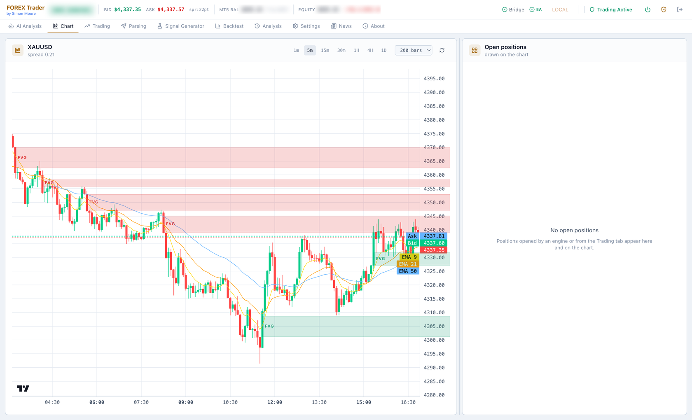
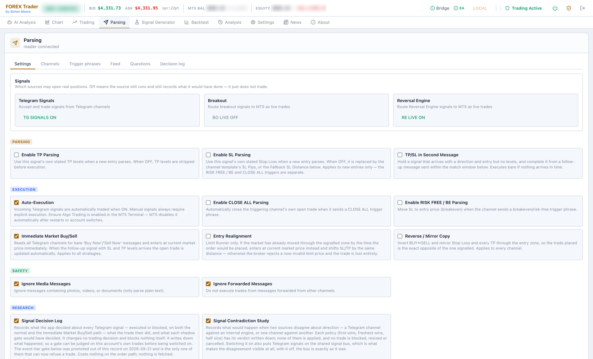
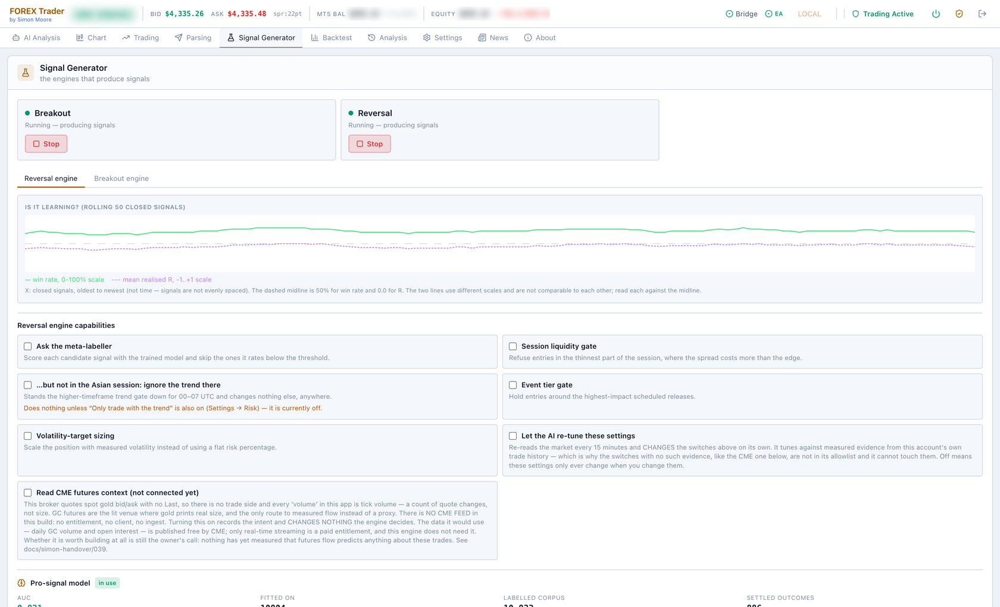
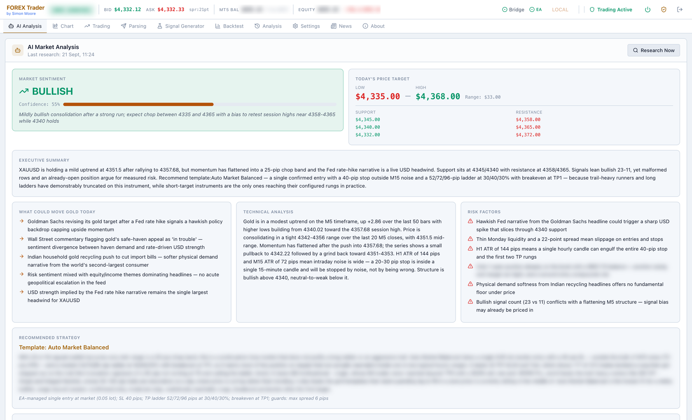
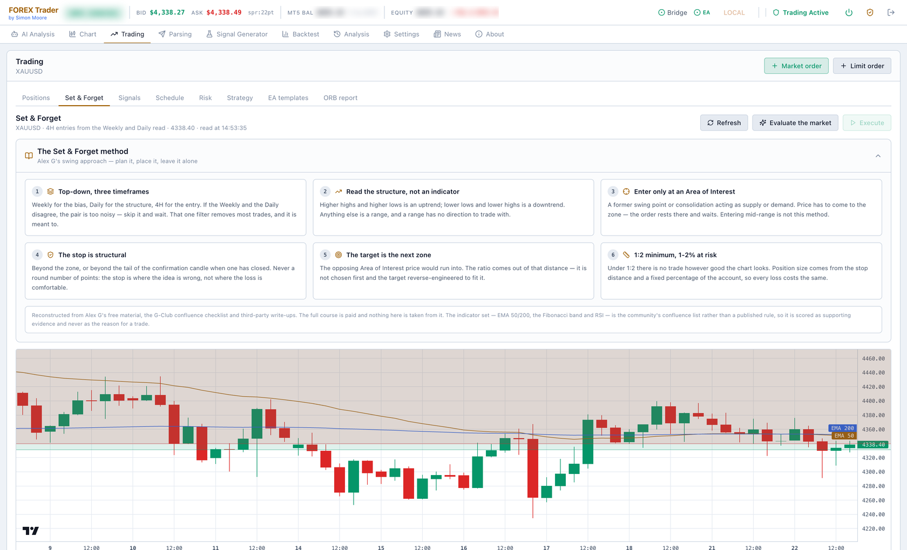

# FOREX Trader

An automated XAUUSD (gold) trading application. It runs its own signal engines,
reads trade calls from Telegram channels, applies deterministic risk rules,
places and manages real orders through MetaTrader 5, and shows every decision
it made in a local web dashboard.

> **This trades real money on a live broker account.**
> Connecting the MT5 bridge and enabling auto-execution places real orders
> against a real account. Nothing here is financial advice. Run it on a demo
> account until you understand what every switch does, and confirm your risk
> settings before you ever point it at live funds.



*The Chart tab — XAUUSD with the structure the engines actually trade drawn on
it: fair value gaps as shaded zones, the EMA 9/21/50 stack, live bid/ask rails
and every open position marked at its entry, stop and targets. Timeframe and
bar count are switchable; this is the same candle data the engines read, not a
separate chart widget.*

---

## Running it

```bash
git clone https://github.com/MooreSi/forex-react.git
cd forex-react
pip install -r requirements.txt
python run.py
```

The dashboard opens at **http://localhost:8888**. There is no licence key and
no login — both gates exist in the code and are switched off for the open
source build (`backend/src/config/edition.py`).

**Requirements**

- Python 3.11+
- A MetaTrader 5 terminal with a broker account, demo or live
- Windows: the `MetaTrader5` Python package, installed automatically
- macOS: the Wine/CrossOver MT5 bridge, plus `libomp` and `git` — installed via
  Homebrew on first run if missing (`FOREX Start.command`, `setup_wine_bridge.sh`)

**Launchers**

| Script | What it does |
|---|---|
| `python run.py` | start the app |
| `Setup & Start FOREX.bat` | Windows: install dependencies and start |
| `FOREX_Trader_Setup.exe` | Windows: guided install |
| `FOREX Start.command` | macOS: start |
| `Start MT5 Bridge.command` | macOS: start the MT5 bridge on its own |
| `Stop FOREX.bat` / `FOREX Stop.command` | stop the app |

On first launch a default `config.yaml` is written to your user data directory
(`%APPDATA%\ForexTrader` on Windows, `~/Library/Application Support/ForexTrader`
on macOS). Nothing in it needs editing by hand — every credential is entered
through the Settings screens in the dashboard.

**Node is a developer dependency only.** The React dashboard is compiled ahead
of time and `frontend/dist` is committed, so installing and running the app
needs nothing but Python.

---

## What it does

It watches Telegram channels where people post gold trade calls — *"buy gold at
this price, stop here, targets there"* — turns those messages into structured
trades, decides whether each one is worth taking and how big it should be,
places the order through MetaTrader 5, and then manages the open position until
it closes: partial profits at each target, stop to breakeven, trailing the
runner.

Alongside the human signals it runs **its own research engines** that generate
and execute trades with no human signal at all, and an adaptive in-trade
manager that recalculates trail distance and breakeven triggers live from
market conditions.

The operating goal is not "make as much as possible". It is **a steady, capped
daily profit without anyone watching the screen**: each day has up to three
trading windows, each with its own profit target, and once a window's target is
reached all new automated entries stop until the next one opens.

Everything it decides is recorded. For any trade you can answer afterwards
which signal produced it, which gates it passed, why it was sized the way it
was, and why it closed.

---

## How it works

Two sources of signals feed one decision pipeline. Nothing reaches the broker
without passing every gate.


### Telegram parsing

A Telethon reader listens to the configured groups and stores every raw
message. A scan pipeline then classifies each one — new signal, edit of an
earlier signal, instant entry, limit order, logic keyword, or noise — and parses
it with per-channel deterministic regexes covering the formats these channels
actually use (`Sell Gold 4520 - 4512`, `Direction / ENTRY / TP` blocks,
`XAU USD BUY NOW`, limit-order layouts).

The parts that matter in practice:

- **Edits are signals too.** Telegram delivers an edit as the same message ID
  with new text. A signal that arrives with a direction and no levels is held,
  and completed when the follow-up message lands inside the match window.
- **The AI fallback only runs when the regexes miss.** When a channel changes
  its format, the model extracts the levels, and a deterministic regex rule is
  then *generated* from the approved result so the next message parses without
  an AI call. No AI-generated code is ever executed — only pattern strings, and
  only after they reproduce the human-approved values.
- **Logic keywords** — CLOSE ALL, RISK FREE / BE, TP HIT and friends — are
  recognised per channel and handled conservatively. CLOSE ALL closes only that
  channel's own most recent trade, never everything open.
- **Every source has a scorecard.** Channels are tracked, trusted or paused on
  their own record, and a per-channel AI recommendation proposes which strategy
  that channel's signals should run.
- **A decision log records without deciding.** One row per signal that reaches
  an execution decision, including what the currently-disabled gates *would*
  have decided — so a gate can be judged against this account's own trades
  before it is ever switched on.



*Parsing → Settings — the switchboard for everything above. The top row says
which sources may open real positions; a source that is off still runs and
still records what it would have done, it just does not trade. Below that:
whether to use each signal's own TP and SL levels or the channel template's,
whether to hold a bare direction for a follow-up message, auto-execution, the
safety filters that ignore media and forwarded messages, and the two research
recorders that log decisions and source contradictions without acting on them.*

### The internal signal generator

Two engines produce their own signals from the candle feed and can trade
without any Telegram channel involved. They are **completely isolated from each
other** — separate databases, separate adaptive parameters, separate ML models,
no shared tables and no cross-training. They both read the same market
primitives, and that is the only thing they have in common.

- **Breakout** — trend-following break-and-go and break-and-retest, with a
  22-feature model and a walk-forward harness.
- **Reversal** — an ICT / Smart-Money emulation working from plain OHLC:
  fair value gaps, inverted FVGs, liquidity sweeps and breaker blocks, mapped
  to key levels and a higher-timeframe bias, with a TP1–TP8 ladder and a
  dual-axis model. Only publicly documented definitions are implemented; there
  is no proprietary indicator code in here.

Each engine has exactly **one** file that can touch real money, gated on its own
live-execution toggle. Everything else is virtual tracking with read-only
access to the broker: an engine that is not switched to live still generates
signals, still tracks them to an outcome, and still learns — it simply does not
place orders.

---

## Key features

| | |
|---|---|
| **Two signal sources** | Telegram channels and two internal research engines, on one shared bus |
| **Deterministic parsing** | Per-channel regexes for the real message formats, with edit correction, dedup and staleness guards |
| **AI only where it earns it** | Model calls for format drift, market commentary and strategy advice — never in the order path |
| **Risk Governor** | Risk-% sizing from the real stop distance, hard per-trade ceiling, daily-loss halt, loss-streak cooldown, R:R floor, directional cap |
| **Daily profit target** | Up to three windows a day, each with a target; hitting it stands the system down until the next window |
| **16 strategy templates** | From one-stop-one-target to eight-rung ladders with adaptive trails — per channel, per engine, or per trade |
| **Adaptive position management** | Trail distance, breakeven trigger and TP1 close-% computed live from ATR, ADX, session and momentum, self-calibrated from closed trades |
| **EA bridge** | Optional Expert Advisor inside MetaTrader, so stops and partials are applied at the terminal rather than over the wire — and reclaimed by the app if the EA drops |
| **Reconciliation** | The app's view is continuously checked against what the broker actually holds; bridge outages are recovered, not assumed away |
| **Circuit breaker** | New trades pause after a run of losses, and the failure direction of every risk check is refuse-to-trade |
| **Backtesting** | Every strategy template replayed side by side against historical candles or your own closed trades |
| **Telegram control** | Outbound trade alerts plus ~23 bot commands; the four that can place, close or restart are injected, never owned by the bot layer |
| **Fleet** | A remote client/admin channel so several deployed instances — VPS, test machines — are monitored and updated from one console |
| **10,000+ tests** | Plus nine structural gates and a coverage ratchet that only tightens |

---

## The signal generator in detail



*Signal Generator — each engine runs or stops independently. The "is it
learning?" chart plots win rate and mean realised R over the last 50 closed
signals, so a model that has stopped earning its place is visible rather than
assumed. Below it, each capability is a switch with the honest description of
what it does — including one that is wired but has no data feed, labelled as
such rather than quietly present.*

**What an engine actually does, per cycle:**

1. **Read the market.** Session and session quality, higher-timeframe bias, key
   levels, ATR/ADX/MACD, regime detection — shared primitives, owned by neither
   engine, equally usable live, in a backtest and in an offline study.
2. **Find a candidate.** Breakout looks for a level breaking with follow-through
   or a clean retest; Reversal maps fair value gaps, sweeps and breakers onto
   key levels and waits for price to come to a zone.
3. **Confirm the entry.** Rejection, deceleration or sweep-and-reclaim at the
   level — not just "price touched it".
4. **Ask the model.** Each engine scores its own candidate with its own trained
   model and can skip anything below threshold. The gate is optional per engine,
   and its behaviour when there is no model is documented rather than implied.
5. **Size it.** Either a flat risk percentage or volatility-target sizing, and
   in both cases through the Risk Governor — an engine cannot size its own
   position.
6. **Track it to an outcome, traded or not.** Every signal gets a recorded
   result. That corpus is what the nightly retrain learns from, and what the
   edge statistics are computed from.

**Guardrails worth knowing about:**

- Every parameter an AI is allowed to recommend is **clamped to a min/max
  envelope** before it is applied. The engine never operates outside the safe
  envelope, whatever the model suggests.
- Adaptive re-tuning only touches switches for which this account has measured
  evidence. Switches with no such evidence are not in its allowlist and it
  cannot reach them.
- A model version bump discards fitted models but **never the training data** —
  every closed signal is re-read from the database and older rows are padded, so
  the corpus survives.

---

## Comprehensive market intelligence

The engines do not trade off candles alone. A separate layer of market
structure and context feeds both the engines and the AI analysis, and none of it
touches the database or the broker — they are pure functions over candles and
ticks, which is what makes them equally valid live and in a backtest.

**Structure and liquidity**

- Previous day and week highs and lows, daily and weekly opens, the initial
  balance, session VWAP, point of control and value area
- Fair value gaps, inverted FVGs, liquidity sweeps and breaker blocks
- Key level identification and higher-timeframe bias
- Entry triggers: rejection, deceleration, sweep-and-reclaim

**Conditions**

- Session detection and session *quality* — not just "London is open" but
  whether this part of it is worth trading
- ATR, ADX, MACD histogram and regime detection
- Spread dynamics and cumulative delta, with an explicit feed-capability probe:
  where the broker quotes spot gold with no `Last`, volume is tick volume and
  the code says so rather than pretending otherwise
- Cross-asset correlation and a correlation-aware exposure number

**Events and macro**

- A Forex Factory news-window guard that holds entries around the
  highest-impact scheduled releases
- Macro context via yfinance
- An ORB / IVB pre-London report: range detection, volume profile and a
  backtested target multiple

**Honest statistics**

- Purged and embargoed k-fold, walk-forward validation, deflated Sharpe,
  probability of backtest overfitting, uniqueness weights
- Stops and targets fitted to the measured excursion distribution, with
  bootstrap confidence intervals and a chronological holdout



*AI Analysis — one model call that answers every question together, so the
sentiment, the price target, the drivers, the risks, the levels and the
strategy recommendation cannot disagree with each other. Everything it reads is
optional context: a bridge that will not return H1 candles reduces what the
model knows, it does not turn the page into "analysis failed". The
recommendation names a specific template and argues for it against the
alternatives using this account's own measured trade history — here, why a
short reachable ladder beats a trail-heavy runner in a 25-pip chop band.*

---

## Trading strategies

A signal carries a direction and some levels. What happens to the position
afterwards is the **strategy**, chosen per channel, per engine or per trade.
Sixteen are built in, from one broker-side stop and target with nothing polling
it, to eight-rung ladders with adaptive trails.

| Strategy | What it does |
|---|---|
| **Fixed R:R** | One stop, one target, both set at the broker. No partials, no breakeven, no trailing — MT5 executes them even if the app and the EA are both offline |
| **Scale Out + Breakeven** | The balanced default: 40/30/20/10% closed at TP1–TP4, stop to entry after TP1 |
| **Breakeven Runner** | Bank a first clip, move to breakeven, let the rest run |
| **Trailing Stop** | Trail the whole position behind price |
| **Protected Scale** | Scale out with protection applied earlier in the trade |
| **Conservative** / **Conservative Trial** | Compute their own stop from the fill price and ignore the signal's levels |
| **Scalp Runner** | Short-target, own-stop scalping |
| **Signal Climber** | Front-loaded ladder that banks the heaviest clips first |
| **Trend Ratchet** | Ratchets the stop upward with the trend rather than scaling out |
| **Gold Diggers VIP Copy** | Mirrors that channel's own management style |
| **Reversal Runner** | The reversal engine's TP1–TP8 ladder |
| **Adaptive Runner** / **Adaptive Runner 2** | Trail distance and breakeven trigger recomputed live from ATR, ADX, session and momentum |
| **Limit Runner** | The only strategy that places a genuine broker-side pending limit, via the EA |
| **ORB/IVB Fixed** | The fixed pre-London opening-range setup |

Two design rules run through all of them:

**A strategy that computes its own stop ignores the channel's.** Conservative,
Conservative Trial, Scalp Runner and Fixed R:R set their stop from the actual
fill price, so a mid-trade "SL is now at ..." message from the channel is
refused — it would replace the very level the strategy exists to control.
Signal-following strategies do the opposite on purpose: a channel updating its
levels is information, not interference.

**The geometry is measured, not designed.** Fixed R:R's 4-point stop and
6-point target came out of reconstructing the M1 path of every closed trade,
which showed an average stop of 7.89 points against an average best-case move of
4.29 — upside-down geometry that capped a perfect exit near +0.54R. The
exploitable detail was in the excursions: winners only travelled 2.04 points
against entry before working, losers travelled 8.55. It deliberately has **no**
breakeven move, because adding one reduced expectancy in 8 of 8 configurations
tested — it converts would-be winners into scratches while losers still pay full
freight.



*Trading → Set & Forget — a swing method rather than an automated engine: the
weekly sets the bias, the daily the structure, the 4H the entry, and if the
weekly and daily disagree the pair is too noisy to trade. Orders rest at an Area
of Interest and wait; the stop is structural, beyond the zone rather than at a
round number; the target is the next zone, so the reward:risk falls out of the
distance instead of being reverse-engineered to look acceptable. Evaluate the
market scores the current read against the checklist, and Execute stays disabled
until it passes.*

---

Built and run by [Simon Moore](https://github.com/MooreSi). Contributions
welcome — the rules the codebase holds itself to are in
[docs/system/rules/](docs/system/rules/), starting with
[the golden rules](docs/system/rules/10-golden-rules.md).
