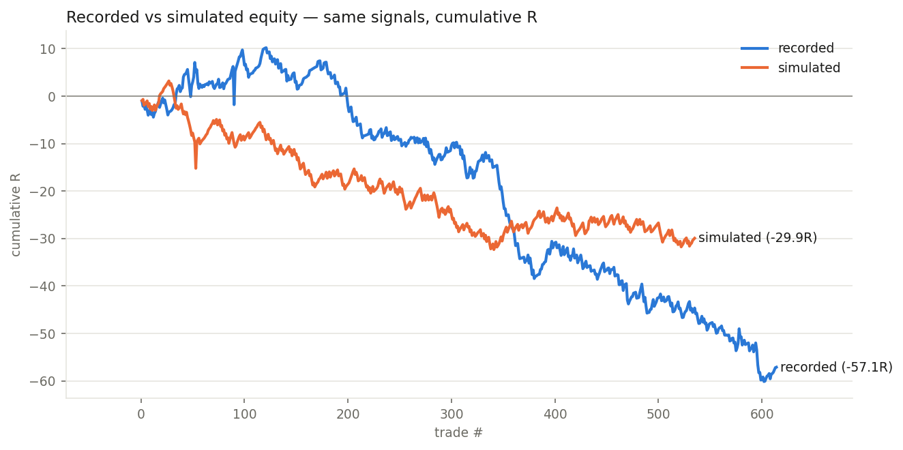

# RESULTS — 001 — baseline replay (simulator calibration)

*Run 2026-08-11 · price source: 60s series (directional only) · data: 2026-07-21 → 2026-07-31 snapshots*

## Headline

The offline simulator reproduces recorded history well enough to rank ideas: 85% win/loss agreement, 84% P&L sign agreement, and the replayed book loses money like the real one did (-29.9R simulated vs ≈−57R recorded).

## Numbers

|                  |   trades |   candidates |   total_R |   expectancy_R |   win_rate |   avg_win_R |   avg_loss_R |   payoff_ratio |   profit_factor |   max_drawdown_R |
|:-----------------|---------:|-------------:|----------:|---------------:|-----------:|------------:|-------------:|---------------:|----------------:|-----------------:|
| simulated replay |      535 |          735 |    -29.93 |        -0.0559 |      0.673 |       0.457 |       -1.111 |          0.411 |           0.846 |           -34.38 |
| recorded book    |      614 |          735 |    -57.1  |        -0.093  |      0.702 |       0.448 |       -1.368 |          0.328 |           0.772 |           -70.33 |

## Chart

## Caveats

- 60s price series misses ~11% of fills (recorded 83.5% vs simulated 72.8%).
- Zero costs modelled — half the recorded loss magnitude is costs/slippage/live divergence.
- stop_loss column is the post-BE stop; sim reconstructs the original from zone_mid ∓ sl_dist.

## Verdict

KEEP — calibrated for ranking (directional). Re-run first thing after the MT5 M1 candle export lands; until then no experiment quotes dollar numbers.
