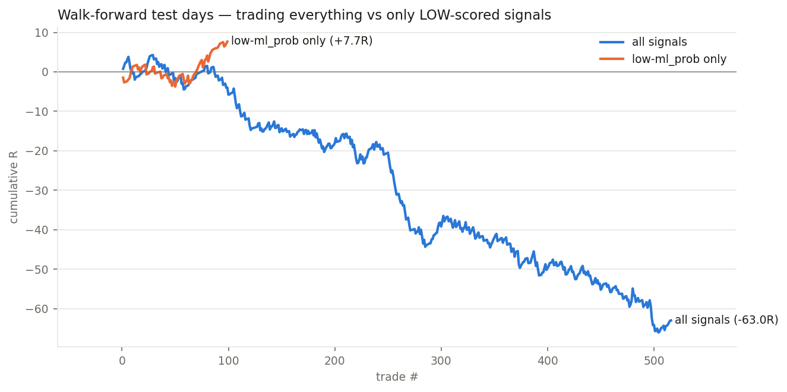

# RESULTS — 002 — ML prob autopsy

*Run 2026-08-11 · price source: recorded outcomes (no simulator) · data: 2026-07-21 → 2026-07-31 snapshots*

## Headline

The engine's ML score is inverted: AUC 0.413 (worse than a coin flip at ranking winners), and a fresh model retrained on the same 24 features also fails (walk-forward AUC 0.465) — the feature pipeline itself carries the inversion, and the live ML gate is currently selecting FOR losers.

## Numbers

|                         |   trades |   candidates |   total_R |   expectancy_R |   win_rate |   avg_win_R |   avg_loss_R |   payoff_ratio |   profit_factor |   max_drawdown_R |
|:------------------------|---------:|-------------:|----------:|---------------:|-----------:|------------:|-------------:|---------------:|----------------:|-----------------:|
| all signals (test days) |      516 |          516 |    -62.99 |        -0.1221 |      0.711 |       0.401 |       -1.41  |          0.284 |           0.7   |           -70.3  |
| ml_prob<-0.10 only      |       99 |          516 |      7.68 |         0.0776 |      0.828 |       0.394 |       -1.449 |          0.272 |           1.312 |            -5.57 |

## Chart

## Caveats

- Labels come from the recorded book, whose geometry is itself upside-down (001-review).
- The low-ml_prob gate keeps only ~20% of trades — inverse signal, not a strategy.
- 607 labelled signals over 9 days; one market regime.

## Verdict

KEEP the finding, DROP the feature set. Minimum action for the backend (when asked): stop using ml_prob as a positive live-execution gate. Next: pin down which of the 24 features carries the inversion.
