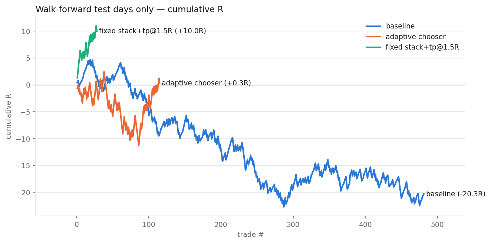

# RESULTS — 003 — filter stack

*Run 2026-08-11 · price source: 60s series (directional only) · data: 2026-07-21 → 2026-07-31 snapshots*

## Headline

The full stack — R:R ≥ 0.75, block 12–16/19 UTC, drop round-number/congestion levels, single 1.5R take-profit — held fixed on unseen days made +10.0R over 28 trades (expectancy +0.357R/trade), while the unfiltered baseline lost -20.3R over 481 trades on the same days. The adaptive day-by-day chooser only managed +0.3R — the value is in the fixed filters, not in switching.

## Numbers

|                                 |   trades |   total_R |   expectancy_R |   win_rate |   payoff_ratio |   profit_factor |   max_drawdown_R |
|:--------------------------------|---------:|----------:|---------------:|-----------:|---------------:|----------------:|-----------------:|
| walk-forward chosen             |      115 |      0.26 |         0.0023 |      0.461 |          1.174 |           1.004 |           -13.78 |
| walk-forward baseline           |      481 |    -20.3  |        -0.0422 |      0.686 |          0.402 |           0.878 |           -27.43 |
| stack+tp@1.5R fixed (test days) |       28 |     10.01 |         0.3575 |      0.607 |          1.168 |           1.805 |            -2.56 |
| [in-sample] baseline            |      535 |    -29.93 |        -0.0559 |      0.673 |          0.411 |           0.846 |           -35.54 |
| [in-sample] rr>=0.75            |      174 |     -3.31 |        -0.019  |      0.632 |          0.555 |           0.954 |           -15.59 |
| [in-sample] block bad hrs       |      327 |     -4.43 |        -0.0136 |      0.7   |          0.41  |           0.959 |           -12.9  |
| [in-sample] good levels         |      117 |     -4.06 |        -0.0347 |      0.65  |          0.49  |           0.909 |           -11.45 |
| [in-sample] stack(filters)      |       30 |      2.9  |         0.0968 |      0.667 |          0.627 |           1.255 |            -3.92 |
| [in-sample] tp@1.0R             |      535 |    -31.88 |        -0.0596 |      0.529 |          0.789 |           0.886 |           -44.53 |
| [in-sample] tp@1.5R             |      535 |      9.25 |         0.0173 |      0.456 |          1.227 |           1.029 |           -21.62 |
| [in-sample] stack+tp@1.5R       |       30 |     10.22 |         0.3408 |      0.6   |          1.165 |           1.747 |            -2.56 |

## Chart

## Walk-forward detail

| test_day   | chosen_config   |   trades |   test_R |   baseline_trades |   baseline_R |
|:-----------|:----------------|---------:|---------:|------------------:|-------------:|
| 2026-07-27 | good levels     |        8 |    -3.38 |                37 |        -1.13 |
| 2026-07-28 | tp@1.5R         |       86 |    -1.83 |                86 |        -6.2  |
| 2026-07-29 | stack+tp@1.5R   |        9 |     1.92 |               131 |       -10.94 |
| 2026-07-30 | stack+tp@1.5R   |       11 |     4.54 |               140 |         1.27 |
| 2026-07-31 | stack+tp@1.5R   |        1 |    -0.97 |                87 |        -3.32 |

## Caveats

- 9 trading days, one strongly-trending gold market — 'on this sample' applies to every number.
- 60-second price series: fills and tight ladders are approximate; re-run on M1 candles before trusting geometry conclusions.
- Filters shrink trade count substantially — see the trades column before celebrating the R totals.
- Zero spread/commission modelled in these runs (cost_R=0).

## Verdict

KEEP (provisional). First config with positive walk-forward expectancy, and every component was motivated by an earlier finding rather than searched for. But 28 trades is far too few to promote anything: NEEDS-M1 for the geometry leg and NEEDS-MORE-DATA (fresh snapshots) before this goes near the backend.
