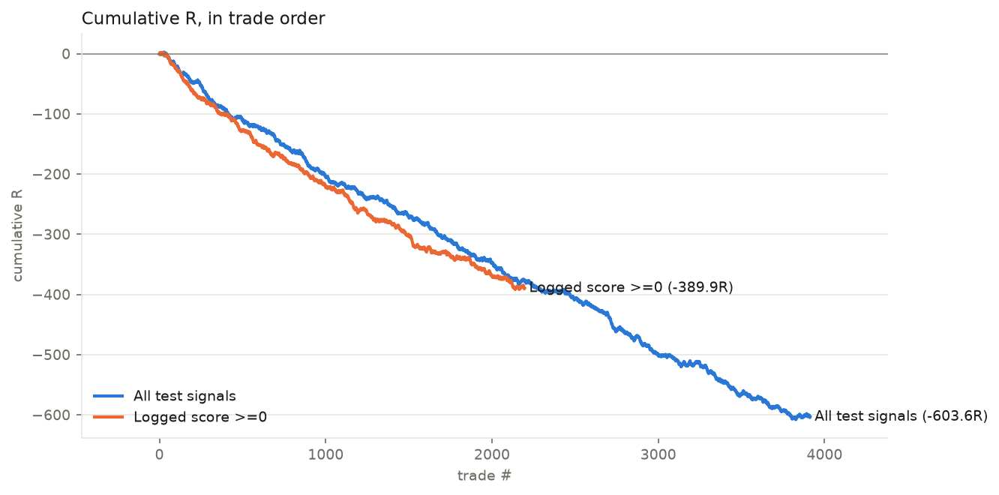

# RESULTS — 004 — Reversal edge review

*Run 2026-10-07 · price source: stored virtual outcomes and stored M1 template labels (no new replay) · data: 2026-07-23 → 2026-10-07; snapshot 2026-10-07T132516Z*

## Headline

Cleaner validation does not establish a deployable gold trading edge; review the full comparison below.

## Numbers

| configuration | trades | candidates | total_R | expectancy_R | win_rate | avg_win_R | avg_loss_R | payoff_ratio | profit_factor | max_drawdown_R |
| --- | --- | --- | --- | --- | --- | --- | --- | --- | --- | --- |
| recorded virtual (all history) | 5203 | 7278 | -439.6 | -0.0845 | 0.745 | 0.338 | -1.32 | 0.256 | 0.749 | -451.1 |
| old template labels (all history) | 6133 | 7278 | -899.6 | -0.1467 | 0.483 | 0.783 | -1.016 | 0.771 | 0.721 | -909.3 |
| same test rows unfiltered | 3913 | 3913 | -603.6 | -0.1543 | 0.477 | 0.787 | -1.012 | 0.778 | 0.709 | -610.5 |
| same test rows unfiltered (+0.25pt cost) | 3913 | 3913 | -799.3 | -0.2043 | 0.477 | 0.737 | -1.062 | 0.694 | 0.632 | -801.3 |
| logged creation score >=0 | 2196 | 3913 | -389.9 | -0.1775 | 0.467 | 0.785 | -1.022 | 0.768 | 0.674 | -393.7 |
| logged creation score >=0 (+0.25pt cost) | 2196 | 3913 | -499.7 | -0.2275 | 0.467 | 0.735 | -1.072 | 0.686 | 0.601 | -502.2 |
| ridge expected R >0.05 | 13 | 3913 | -4.35 | -0.3346 | 0.385 | 0.716 | -0.991 | 0.722 | 0.452 | -5.7 |
| ridge expected R >0.05 (+0.25pt cost) | 13 | 3913 | -5 | -0.3846 | 0.385 | 0.666 | -1.041 | 0.64 | 0.4 | -6 |
| shallow tree R >0.05 | 24 | 3913 | -10.71 | -0.4464 | 0.375 | 0.668 | -1.115 | 0.599 | 0.359 | -9.6 |
| shallow tree R >0.05 (+0.25pt cost) | 24 | 3913 | -11.91 | -0.4964 | 0.375 | 0.618 | -1.165 | 0.53 | 0.318 | -10.75 |
| shuffled-label control >0.05 | 15 | 3913 | 5.96 | 0.3973 | 0.8 | 0.775 | -1.115 | 0.695 | 2.782 | -1.12 |
| shuffled-label control >0.05 (+0.25pt cost) | 15 | 3913 | 5.21 | 0.3473 | 0.8 | 0.725 | -1.165 | 0.623 | 2.491 | -1.17 |

## Chart

## Validation

3913 test rows on 36 days; expanding training on earlier whole days only. Actual label-availability times plus one-hour gap. Fixed models and +0.05R threshold. Retrospective research; no untouched future holdout. Confidence intervals in output/audit.json.

## Diagnostics

| configuration | auc_net_positive | mean_predicted_r | mean_actual_r |
| --- | --- | --- | --- |
| ridge | 0.5048 | -0.1448 | -0.1543 |
| tree | 0.5007 | -0.1441 | -0.1543 |
| shuffled | 0.4957 | -0.1512 | -0.1543 |
| ml_prob | 0.4874 | -0.004582 | -0.1542 |

## Caveats

- tpl_r replays the OLD fixed template with 0.575pt costs; it does not label today's dynamic ATR template.
- Creation-time vectors and creation-time logged scores; fill-time vectors are not stored. This cannot validate a fill-time model.
- Historical labels span multiple management/code epochs; copied history is not automatically point-in-time reproducible.
- Overlapping trades and variable trade count; cumulative per-trade curves are descriptive, not a portfolio backtest.
- All labels are recorded; no fresh M1/tick replay. Cost stress adds 0.25pt divided by the OLD 5pt stop.
- Several challengers inspected: any apparent winner needs a new locked forward period and correction for research selection.
- Shared metric table omits initial zero equity in drawdown; corrected companion values are in output/audit.json.

## Verdict

NEEDS-MORE-DATA — freeze the target policy and record fresh decision-time features before promotion.
